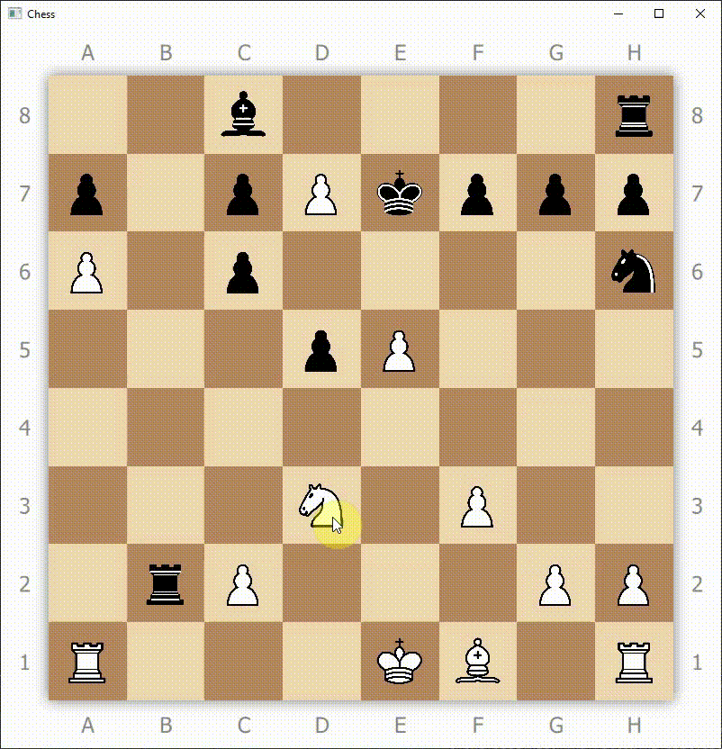

# Table of Contents <!-- omit in toc -->
- [Developers](#developers)
- [Description](#description)
- [Usage](#usage)
  - [Spiel starten](#spiel-starten)
  - [Bewegen von Figuren](#bewegen-von-figuren)
- [Qt](#qt)
  - [Deployment (Windows)](#deployment-windows)

# Developers

* Johannes Gaiser
* Joel Schmid
* Peter Würth

# Description


Muss-Funktionen:

- [x] vollständiges Schach:
  * normale Zugregeln aller Figuren
  * En Passant
  * Bauernumwandlung
  * Rochade
- [x] Schach KI
- [x] Single- und Multiplayer

Kann-Funktionen:

- [x] unterschiedliche KI Schwierigkeiten
- [x] GUI

Zusätzlich:

- [x] Speichern und Laden von Spielen in [FEN-Notation](https://de.wikipedia.org/wiki/Forsyth-Edwards-Notation)

# Usage

## Spiel starten

* Chess-Porgramm öffnen
* Zu Beginn stehen verschiedenen Auswahlmöglichkeiten zur Verfügung:
  
  * Single- oder Multiplayer
  * falls Singleplayer: KI-Schwierigkeit (leicht, normal oder schwer)
  * Neues Spiel starten oder ein bestehendes Spiel in FEN-Notation laden <br> (durch direkte Eingabe oder das öffnen einer Datei, die die FEN-Notation enthält möglich)

* Während des Spiels können durch Rechtsklick auf das Spielfeld verschiedene Aktionen ausgeführt werden:
  * Neues Spiel (verwirft das aktuelle Spiel ohne erneute Bestätigung)
  * Spiel laden (verwirft das aktuelle Spiel beim Laden)
  * Beenden und Speichern
  * Beenden ohne Speichern (schließt das Programm ohne erneute Bestätigung)

## Bewegen von Figuren
* Durch klick auf eine Figure werden alle legalen Zugmöglichkeiten dieser Figure durch grüne Felder angezeigt

  

  (Falls keine grünen Felder erscheinen liegt dies daran, dass die Figur entweder die falsche Farbe hat - also dem Gegener gehört - oder keine legalen Zugmöglichkeiten besitzt weil z.B. alle möglichen Züge durch andere Figuren der gleichen Farbe blockiert werden oder der eigene König im Schach steht)

* Ein Klick auf ein nicht-grünes Feld blendet die grünen Felder wieder aus und ermöglich das Auswählen einer anderen Figure
* Ein Klick auf ein grünes Feld bewegt die ausgewählte Figur auf die gewählte Position 
  
  

* Im Singleplayer-Modus erfolgt nach dem eigenen Zug automatisch der Zug der KI

# Qt

Die GUI wurde mit Qt 5.12 und Qt Quick entwickelt.

Unter [releases](https://github.com/GrafZ3pp3lin/Chess/tree/master/releases) ist bereits eine Anwedungen für Windows (x64) zu finden.

## Deployment (Windows)

Die `.exe` im release-Ordner sich außerhalb des QtCreators nicht ohne weiteres öffnen, da die benötigten `.dll` Dateien fehlen. (Im QtCreator funktioniert es, weil dieser weiß, wo die `.dll`s liegen)

Mithilfe des Tools `windeployqt`, das von Qt mitgeliefert wird, lassen sich die fehlenden Dateien zum release-Ordner hinzufügen:

1. Release mit QtCreator erstellen
2. Im Release-Ordner alles außer Chess.exe löschen
3. Konsole im Verzeichnis des verwendeten Qt-Compilers öffnen <br>
   (Wenn Qt im Standardverzeichnis installiert wird ist es für MinGW z.B. `C:\Qt\5.12.0\mingw73_64`)
4. Folgeden Befehl ausführen:
   
   ```
   windeployqt --quick --no-translations --qmldir path\to\Chess-Repository path\to\release\Chess.exe
   ```
